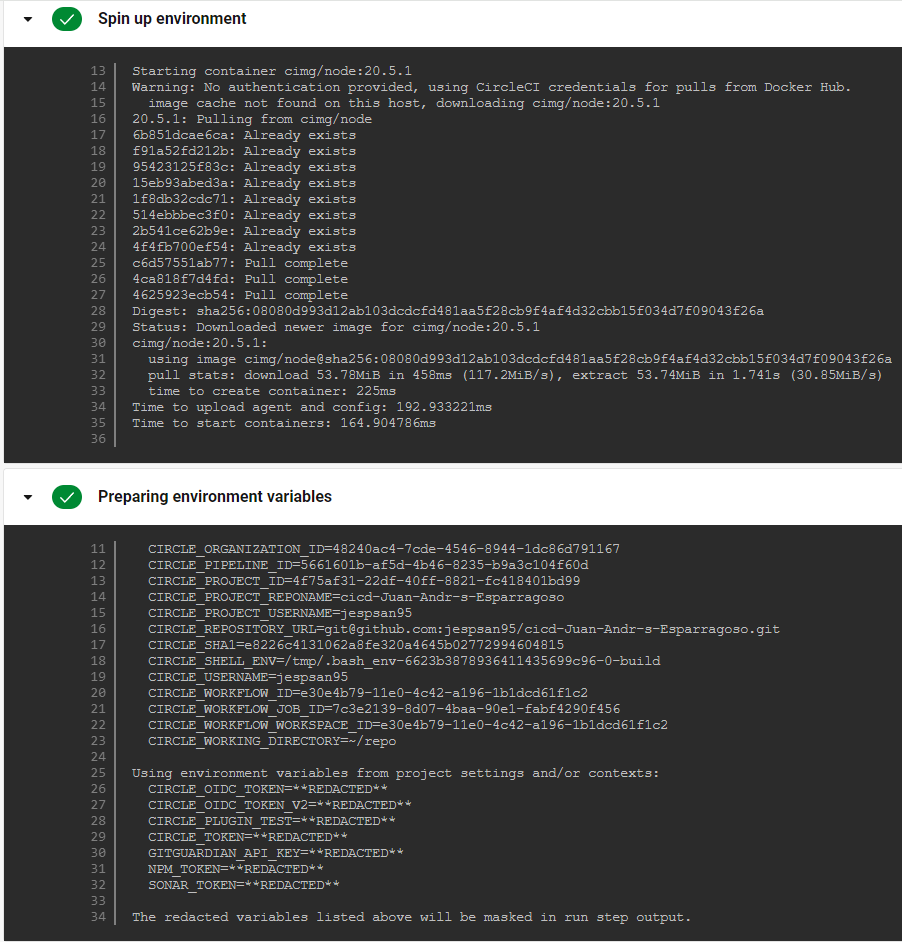
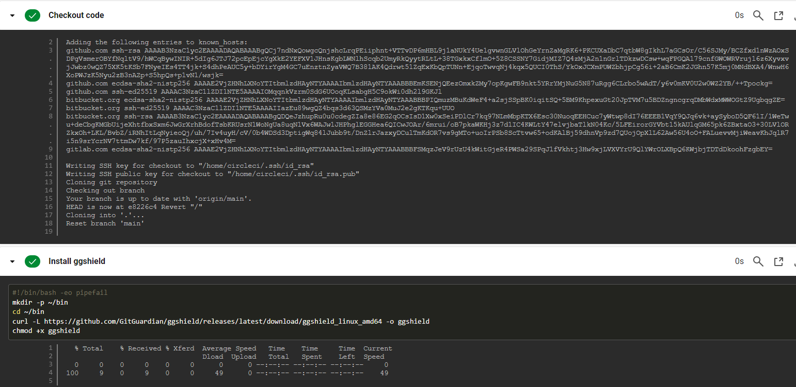
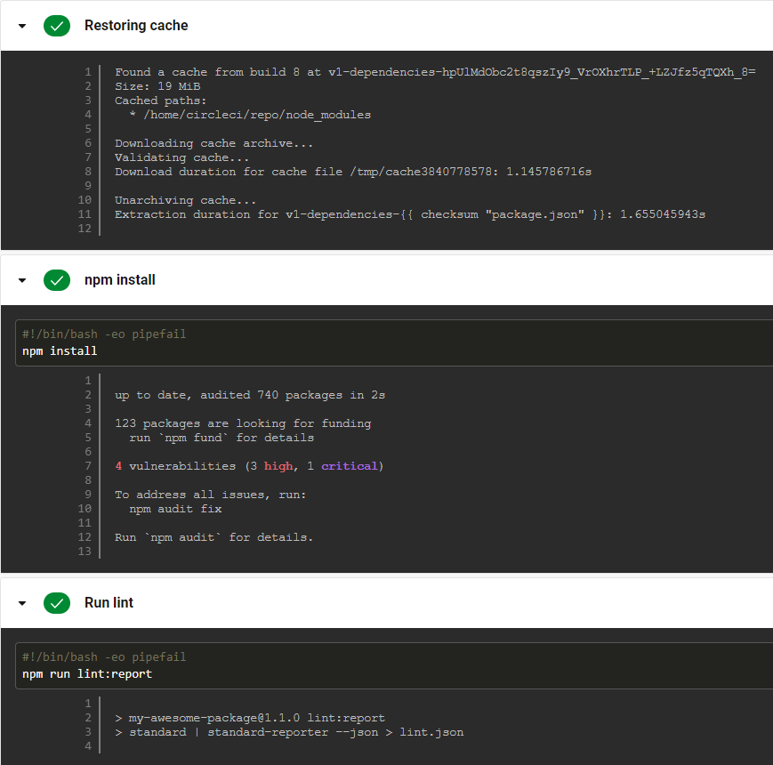
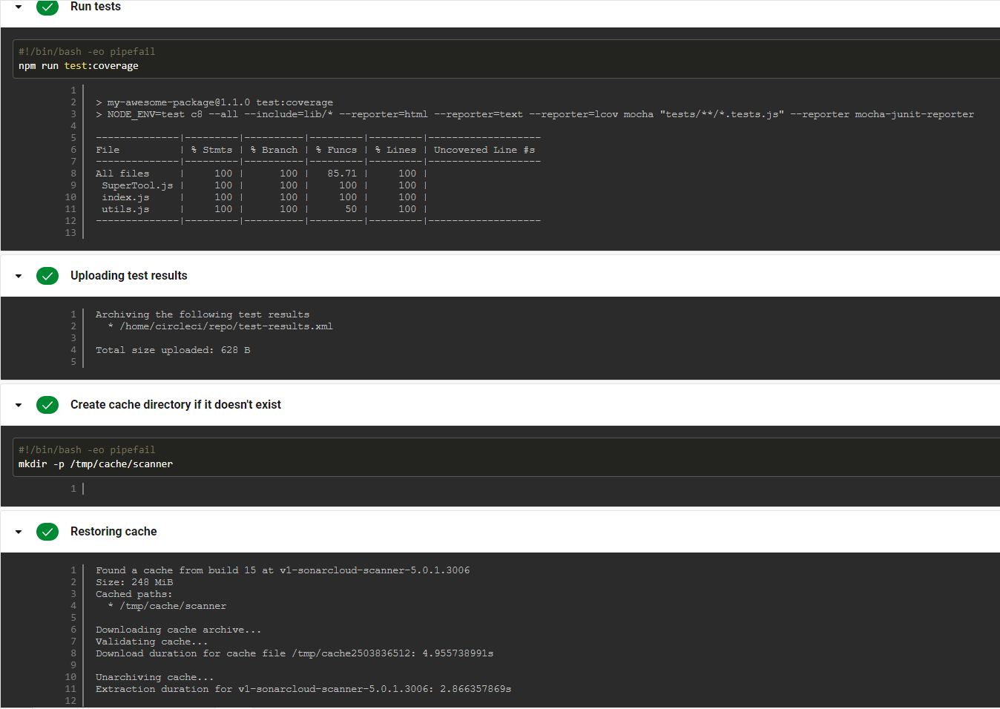
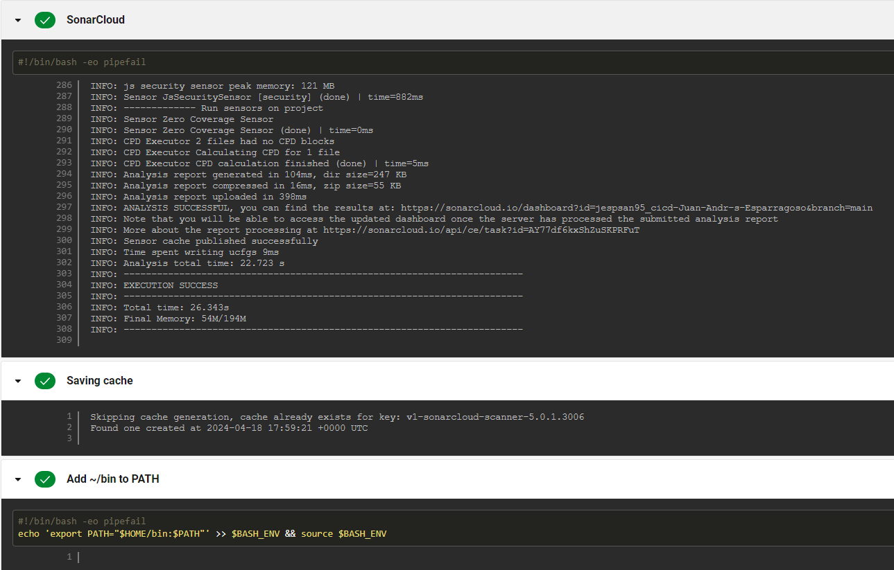
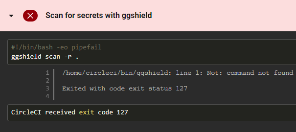
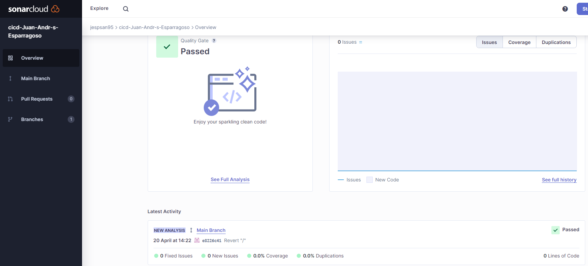
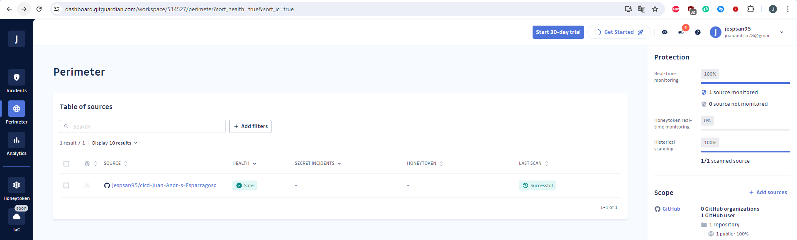

1. Enlace al repositorio de GitHub donde se encuentra el código de la aplicación. -> https://github.com/jespsan95/cicd-Juan-Andr-s-Esparragoso

3. El fichero de configuración del pipeline de CI/CD. -> .circleci\config.yml

4. Screenshots del pipeline de CI/CD.
4.1 
4.2 
4.3 
4.4 
4.5 
4.6 

8. Screenshot del proyecto en SonarCloud.

9. Screenshot del proyecto en GitGuardian.
